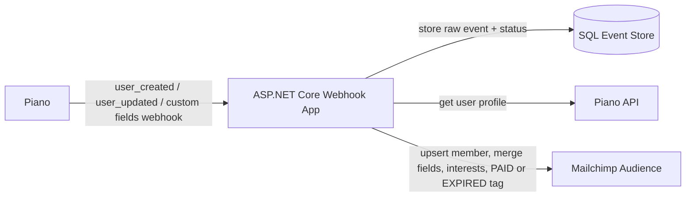
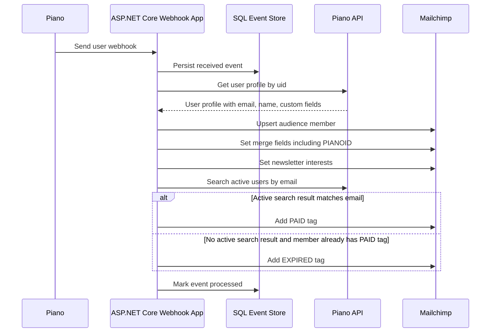
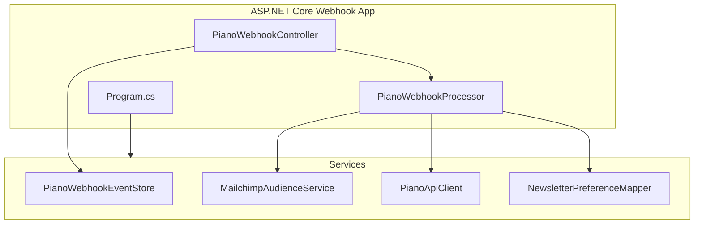

# Architecture

## Overview

```mermaid
flowchart LR
    Piano[Piano] -->|user_created / user_updated / custom fields webhook| WebhookApi[ASP.NET Core Webhook App]
    WebhookApi -->|store raw event + status| EventStore[(SQL Event Store)]
    WebhookApi -->|get user profile| PianoApi[Piano API]
    WebhookApi -->|upsert member, merge fields, interests, PAID or EXPIRED tag| Mailchimp[Mailchimp Audience]
```

## Webhook Sync

```mermaid
sequenceDiagram
    participant Piano
    participant Webhook as ASP.NET Core Webhook App
    participant Store as SQL Event Store
    participant PianoApi as Piano API
    participant Mailchimp

    Piano->>Webhook: Send user webhook
    Webhook->>Store: Persist received event
    Webhook->>PianoApi: Get user profile by uid
    PianoApi-->>Webhook: User profile with email, name, custom fields
    Webhook->>Mailchimp: Upsert audience member
    Webhook->>Mailchimp: Set merge fields including PIANOID
    Webhook->>Mailchimp: Set newsletter interests
    Webhook->>PianoApi: Search active users by email
    alt Active search result matches email
        Webhook->>Mailchimp: Add PAID tag
    else No active search result and member already has PAID tag
        Webhook->>Mailchimp: Add EXPIRED tag
    end
    Webhook->>Store: Mark event processed
```

## Deployment Unit

```mermaid
flowchart TB
    subgraph WebhookApp[ASP.NET Core Webhook App]
        Program[Program.cs]
        Controller[PianoWebhookController]
        Processor[PianoWebhookProcessor]
    end

    subgraph Services[Services]
        EventStore[PianoWebhookEventStore]
        MailchimpSvc[MailchimpAudienceService]
        PianoSvc[PianoApiClient]
        Mapper[NewsletterPreferenceMapper]
    end

    Program --> Services
    Controller --> EventStore
    Controller --> Processor
    Processor --> MailchimpSvc
    Processor --> PianoSvc
    Processor --> Mapper
```
