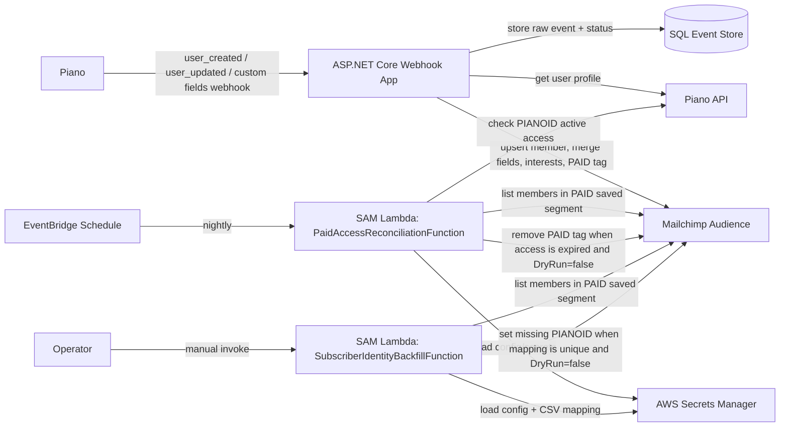
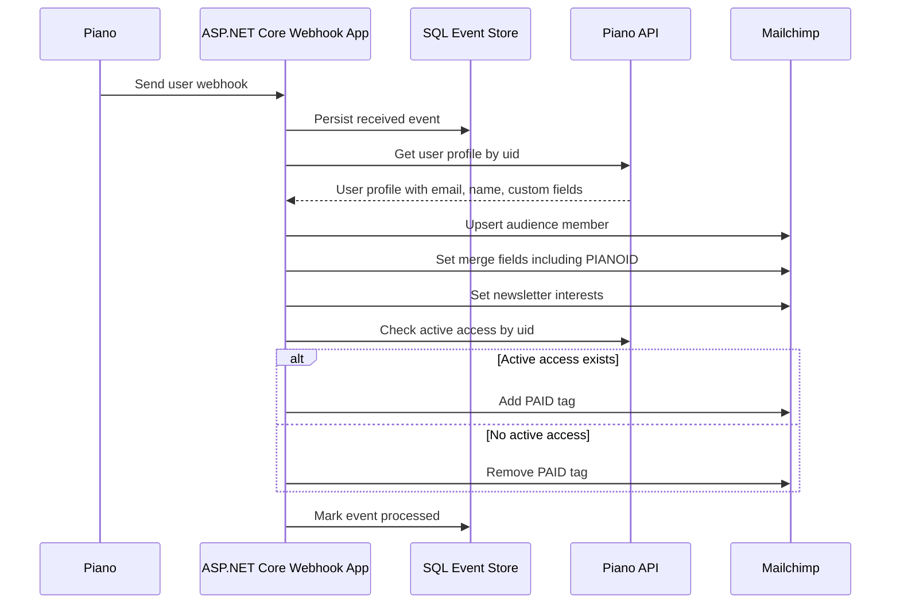
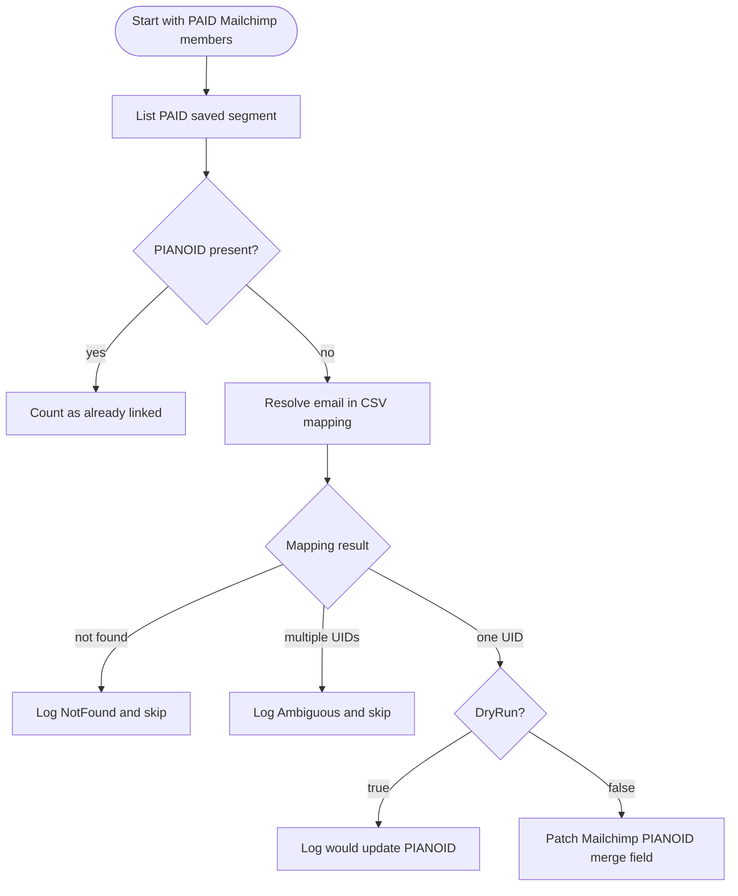
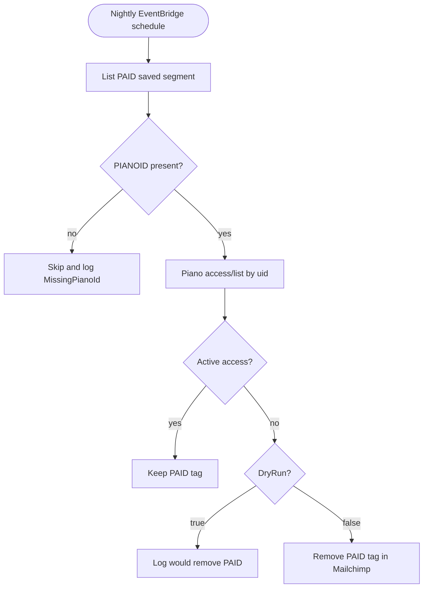
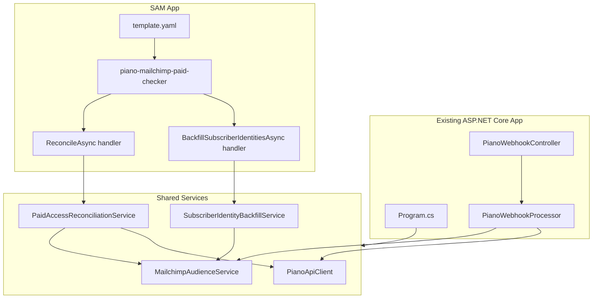

# Architecture

## Overview

```mermaid
flowchart LR
    Piano[Piano] -->|user_created / user_updated / custom fields webhook| WebhookApi[ASP.NET Core Webhook App]
    WebhookApi -->|store raw event + status| EventStore[(SQL Event Store)]
    WebhookApi -->|get user profile| PianoApi[Piano API]
    WebhookApi -->|upsert member, merge fields, interests, PAID tag| Mailchimp[Mailchimp Audience]

    EventBridge[EventBridge Schedule] -->|nightly| SamReconcile[SAM Lambda: PaidAccessReconciliationFunction]
    SamReconcile -->|load config/secrets| Secrets[AWS Secrets Manager]
    SamReconcile -->|list members in PAID saved segment| Mailchimp
    SamReconcile -->|check PIANOID active access| PianoApi
    SamReconcile -->|remove PAID tag when access is expired and DryRun=false| Mailchimp

    Operator[Operator] -->|manual invoke| SamBackfill[SAM Lambda: SubscriberIdentityBackfillFunction]
    SamBackfill -->|load config + CSV mapping| Secrets
    SamBackfill -->|list members in PAID saved segment| Mailchimp
    SamBackfill -->|set missing PIANOID when mapping is unique and DryRun=false| Mailchimp
```

## Webhook Sync

```mermaid
sequenceDiagram
    participant Piano
    participant Webhook as ASP.NET Core Webhook App
    participant Store as SQL Event Store
    participant PianoApi as Piano API
    participant Mailchimp

    Piano->>Webhook: Send user webhook
    Webhook->>Store: Persist received event
    Webhook->>PianoApi: Get user profile by uid
    PianoApi-->>Webhook: User profile with email, name, custom fields
    Webhook->>Mailchimp: Upsert audience member
    Webhook->>Mailchimp: Set merge fields including PIANOID
    Webhook->>Mailchimp: Set newsletter interests
    Webhook->>PianoApi: Check active access by uid
    alt Active access exists
        Webhook->>Mailchimp: Add PAID tag
    else No active access
        Webhook->>Mailchimp: Remove PAID tag
    end
    Webhook->>Store: Mark event processed
```

## Backfill Rollout

```mermaid
flowchart TD
    Start([Start with PAID Mailchimp members]) --> List[List PAID saved segment]
    List --> HasPianoId{PIANOID present?}
    HasPianoId -->|yes| Already[Count as already linked]
    HasPianoId -->|no| Resolve[Resolve email in CSV mapping]
    Resolve --> Result{Mapping result}
    Result -->|not found| NotFound[Log NotFound and skip]
    Result -->|multiple UIDs| Ambiguous[Log Ambiguous and skip]
    Result -->|one UID| DryRun{DryRun?}
    DryRun -->|true| WouldUpdate[Log would update PIANOID]
    DryRun -->|false| Update[Patch Mailchimp PIANOID merge field]
```

## Nightly Paid Access Reconciliation

```mermaid
flowchart TD
    Schedule([Nightly EventBridge schedule]) --> List[List PAID saved segment]
    List --> HasPianoId{PIANOID present?}
    HasPianoId -->|no| Skip[Skip and log MissingPianoId]
    HasPianoId -->|yes| Check[Piano access/list by uid]
    Check --> Active{Active access?}
    Active -->|yes| Keep[Keep PAID tag]
    Active -->|no| DryRun{DryRun?}
    DryRun -->|true| WouldRemove[Log would remove PAID]
    DryRun -->|false| Remove[Remove PAID tag in Mailchimp]
```

## Deployment Units

```mermaid
flowchart TB
    subgraph ExistingApp[Existing ASP.NET Core App]
        Program[Program.cs]
        Controller[PianoWebhookController]
        Processor[PianoWebhookProcessor]
    end

    subgraph SharedServices[Shared Services]
        MailchimpSvc[MailchimpAudienceService]
        PianoSvc[PianoApiClient]
        ReconcileSvc[PaidAccessReconciliationService]
        BackfillSvc[SubscriberIdentityBackfillService]
    end

    subgraph SamApp[SAM App]
        Template[template.yaml]
        LambdaProject[piano-mailchimp-paid-checker]
        ReconcileFn[ReconcileAsync handler]
        BackfillFn[BackfillSubscriberIdentitiesAsync handler]
    end

    Program --> SharedServices
    Controller --> Processor
    Processor --> MailchimpSvc
    Processor --> PianoSvc

    Template --> LambdaProject
    LambdaProject --> ReconcileFn
    LambdaProject --> BackfillFn
    ReconcileFn --> ReconcileSvc
    BackfillFn --> BackfillSvc
    ReconcileSvc --> MailchimpSvc
    ReconcileSvc --> PianoSvc
    BackfillSvc --> MailchimpSvc
```
